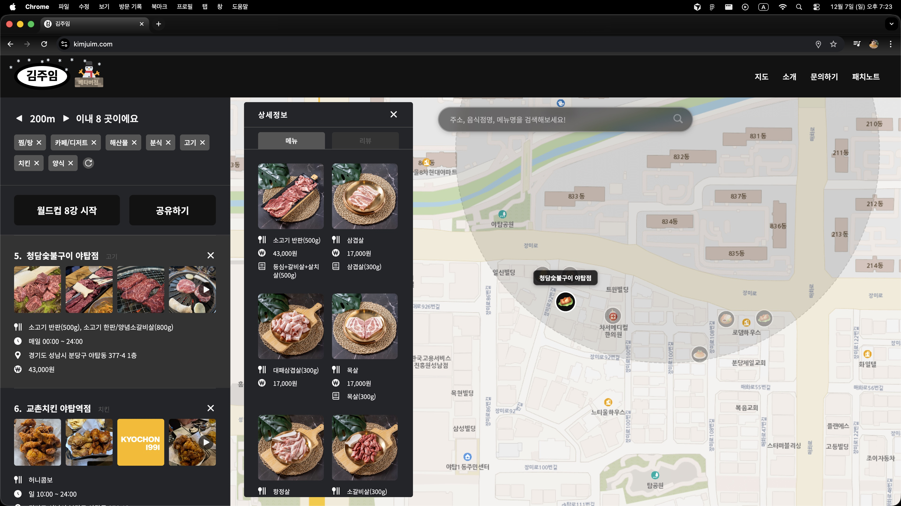
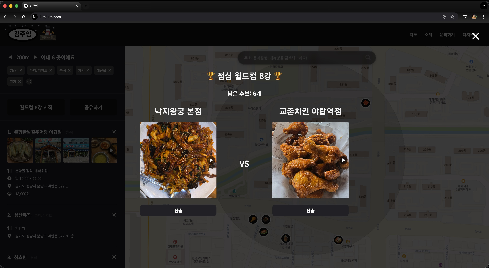
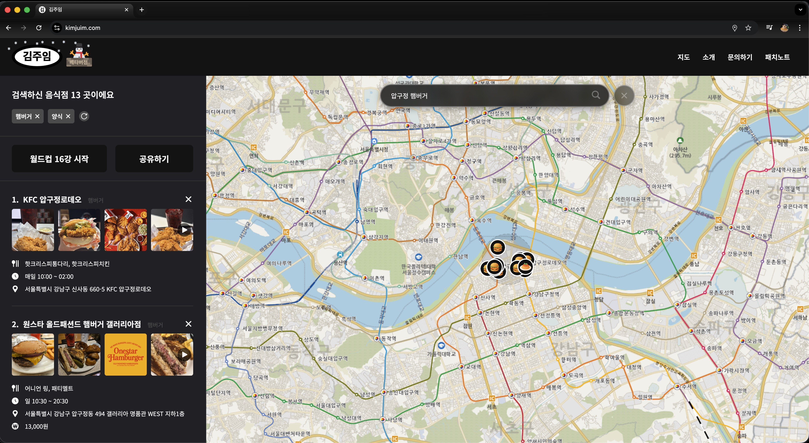
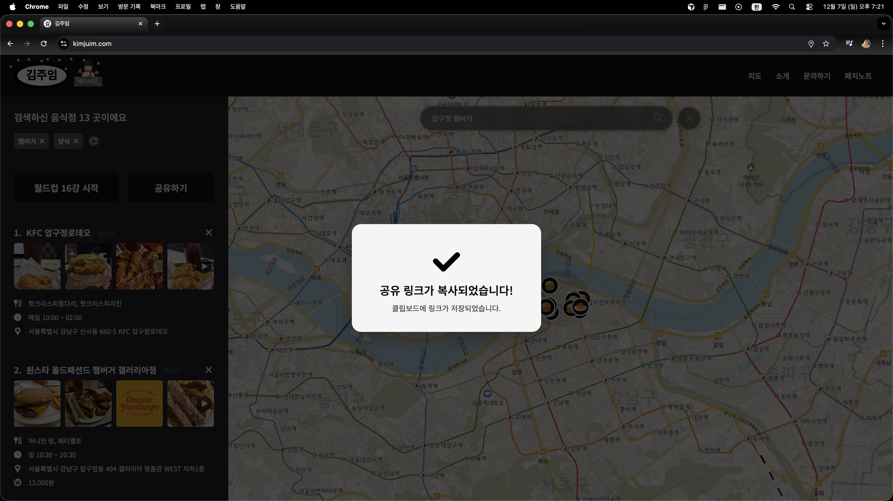
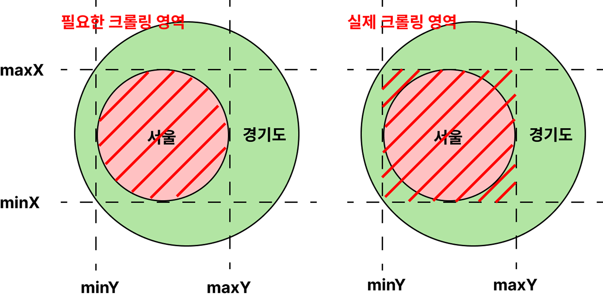
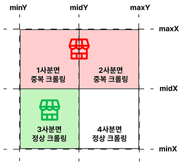
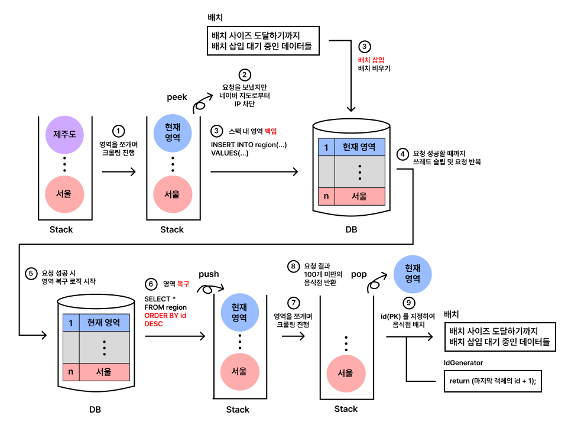

# 🍽️ 김주임

> **"김주임 님, 점심 메뉴 좀 추천해주세요."** 
>
> 직장인 최대 고민 식사 메뉴 정하기. 김주임이 해결해드립니다!
> 
> 🔗 **서비스 바로가기**: [kimjuim.com](https://kimjuim.com) (현재 베타버전 운영 중)

<br/>



<br/>



<br/>



<br/>



<br/>
<br/>
<br/>

## 🛠️ 기술 스택

| 분류 | 기술                                           |
|:---:|:---------------------------------------------|
| **Frontend** | React, TypeScript, OpenLayers (VWorld Map)   |
| **Backend** | Spring Boot, JPA                             |
| **Database** | PostgreSQL (PostGIS), Elasticsearch          |
| **Infra** | Docker, Docker Compose, Nginx, Let's Encrypt |
| **Crawler** | Java, PostgreSQL (반복 DFS 알고리즘)               |

<br/>
<br/>
<br/>

## 🔥 개발 과정 중 만난 문제들

<br/>

### 1. 크롤러

<br/>

#### 📌 재귀 DFS → 반복 DFS 알고리즘 전환

**문제 상황**
- 호스트 서버는 영역(minX, minY, maxX, maxY) 쿼리 시 최대 100개의 음식점만 반환
- 재귀 DFS로 영역을 쪼개며 크롤링하던 중, 실행 이틀 차에 **스택 오버플로우 발생**

**해결 방법**
- 재귀 DFS를 **반복 DFS 알고리즘**으로 전환하여 콜스택 제한 회피
- 4주 동안 국내 **약 80만 개**의 음식점 데이터 수집 완료


<br/>
<br/>

#### 📌 음식점 중복 크롤링 해결

**문제 상황**
1. 사각형 영역과 실제 행정구역 불일치로 인한 중복
2. 영역 경계에 걸친 음식점의 중복

|                      문제 1 예시                       |                      문제 2 예시                       |
|:--------------------------------------------------:|:--------------------------------------------------:|
|  |  |

**해결 방법**

```java
// 문제 1: 주소 검증으로 타겟 행정구역 음식점만 저장
if (address.substring(0, 7).contains("서울")) {
    // 검증 성공
}
```

```java
// 문제 2: HashSet으로 중복 체크
if (RESTAURANT_IDS.contains(restaurantId)) {
    // 이미 크롤링한 음식점이므로 스킵
}
```

<br/>
<br/>

#### 📌 IP 차단 시 데이터 백업 및 복구 로직

**문제 상황**
- 일정 횟수 이상 요청 시 호스트 서버에서 IP 차단
- 해외 프록시는 비정상 요청으로 간주되어 차단, 국내 프록시는 비용 문제

**해결 방법**
- IP 차단 시점의 **스택 내 영역들을 DB에 백업**
- 차단 해제 후 백업된 영역부터 크롤링 재개하는 **복구 로직 구현**

| 백업 로직|
|:---:|
|  |

<br/>
<br/>

#### 📌 배치 삽입으로 저장 효율 개선

**문제 상황**
- 80만 개 음식점 + 메뉴, 리뷰, 영업시간 등 개별 INSERT 시 수백만 번의 쿼리 발생

**해결 방법**
- `AUTO_INCREMENT` 대신 **수동 PK 관리**로 INSERT 전 ID 확정
- 메뉴 등 자식 엔티티에 FK 설정 후 **배치에 모아서 한 번에 INSERT**
- 최대 **5,000개의 음식점**과 관련 데이터를 1번의 INSERT로 저장

<br/>
<br/>
<br/>

---

<br/>
<br/>
<br/>

### 2. 서버

<br/>

#### 📌 공간 인덱스 적용

**문제 상황**
- 서울/경기 31만 개 음식점 대상, 강남 특정 위치 500m 이내 조회 시 **1,137ms** 소요
- `ST_Distance` 함수가 공간 인덱스를 사용하지 않아 풀 테이블 스캔 발생

**해결 방법**
```sql
-- Before: 공간 인덱스 미사용
WHERE ST_Distance(location, point) < 500

-- After: 공간 인덱스 사용
WHERE ST_DWithin(location, point, 500)
```
→ 쿼리 시간 **842ms**로 개선

<br/>
<br/>

#### 📌 LEFT JOIN LATERAL + jsonb_agg로 카테시안 곱 해결

**문제 상황**
- 음식점 1개 조회 시 이미지, 메뉴, 영업시간 등 다중 1:N JOIN 필요
- 실제 음식점 1,002개가 **751,396 로우**까지 확장 (카테시안 곱)

**해결 방법**
```sql
-- LEFT JOIN LATERAL + jsonb_agg 사용
SELECT r.*, 
  (SELECT jsonb_agg(...) FROM menu WHERE restaurant_id = r.id) as menus,
  (SELECT jsonb_agg(...) FROM image WHERE restaurant_id = r.id) as images
FROM restaurant r
WHERE ST_DWithin(...)
```

**추가 최적화**
- `Geography` → `Geometry` 타입 전환으로 삼각함수 대신 피타고라스 공식 사용
- 거리 정확도 약 12% 감소하나 성능 대폭 개선

| 방식 | 로우 수 | 쿼리 시간 |
|:---:|:---:|:---:|
| LEFT JOIN + Geography | 751,396 | 842ms |
| **LEFT JOIN LATERAL + Geometry** | **879** | **49ms** |

<br/>
<br/>

#### 📌 disMax 쿼리로 검색 정확도 개선

**문제 상황**
- 단순 토큰 매칭 빈도수(TF) 기반 검색 시, 주소나 메뉴에서 토큰이 중복되면 정확도 저하
- 예: "강남 초밥집" 검색 시 메뉴에 "강남[1등맛집]"이 반복되는 삼겹살집이 상위 노출

**해결 방법**
```json
{
  "dis_max": {
    "queries": [
      { "constant_score": { "filter": { "match": { "address": "강남 초밥집" }}, "boost": 4 }},
      { "constant_score": { "filter": { "match": { "name": "강남 초밥집" }}, "boost": 3 }},
      { "constant_score": { "filter": { "match": { "category": "강남 초밥집" }}, "boost": 3 }},
      { "constant_score": { "filter": { "match": { "menu": "강남 초밥집" }}, "boost": 2 }}
    ]
  }
}
```

- **disMax**: 필드 간 토큰 중복 시 최고점만 사용
- **constantScore**: 필드 내 토큰 중복 가중치 방지
- **boost**: 주소(4) > 이름(3) = 카테고리(3) > 메뉴(2)

<br/>
<br/>

#### 📌 검색 자동완성 - 필드 내 disMax 다중 쿼리

**해결 방법**
- 키워드 완전 일치(20) > 토큰 일치(12) > 접두사 일치(6) > ngram 일치(5)
- `edge_ngram_tokenizer` (min_gram=2, max_gram=10) 적용

<br/>
<br/>
<br/>

---

<br/>
<br/>
<br/>

### 3. 클라이언트

<br/>

#### 📌 Intersection Observer API로 이미지 로딩 최적화

**문제 상황**
- 최대 반경 500m에서 수백 개 음식점, 각 평균 9개 이미지 → 수천 개 이미지 로딩 가능
- 지도에서 음식점 클릭 시 리스트 자동 스크롤 → 지나치는 모든 음식점 이미지 로딩

**해결 방법**
```typescript
const { ref, inView } = useInView({
  threshold: 0.1,
  rootMargin: '100px'
})

useEffect(() => {
  if (inView && !shouldRender) {
    const timer = setTimeout(() => {
      setShouldRender(true)  // 1.5초 이상 머무를 때만 이미지 로딩
    }, 1500)
    return () => clearTimeout(timer)
  }
}, [inView])
```

<br/>
<br/>
<br/>

---

<br/>
<br/>
<br/>

### 4. 인프라

**구성**
- Nginx (+ React 빌드) + Spring Boot + PostgreSQL + Elasticsearch

**해결 방법**
- 로컬에서 크롤링(PostgreSQL), 인덱싱(Elasticsearch) 완료 후 백업
- 모든 모듈을 로컬에서 이미지로 빌드 후 **Docker Compose로 한 번에 배포**하는 bash 스크립트 작성

```bash
# 배포 명령어
./deploy-prod.sh
```

<br/>
<br/>
<br/>

## 📁 프로젝트 구조 및 관련 소스코드

```
kimjuim/
├── be/                     # Spring Boot 백엔드
├── fe/kimjuim-fe/          # React 프론트엔드
├── crawler/                # java 크롤러 소스코드 (미공개)
├── docker/                 # Docker 설정 파일 (미공개)
│   ├── nginx/
│   ├── postgres/
│   ├── elasticsearch/
│   └── spring/
├── docker-compose.prod.yml # ec2에 카피할 도커 컴포즈 파일 (미공개)
└── deploy-prod.sh          # 배포 스크립트 (미공개)
```

[서버 소스코드](https://github.com/KimChanJin97/kimjuim-be)

[클라이언트 소스코드](https://github.com/KimChanJin97/kimjuim-fe)

<br/>
<br/>
<br/>

## 📝 License

This project is licensed under the MIT License.

<br/>
<br/>
<br/>